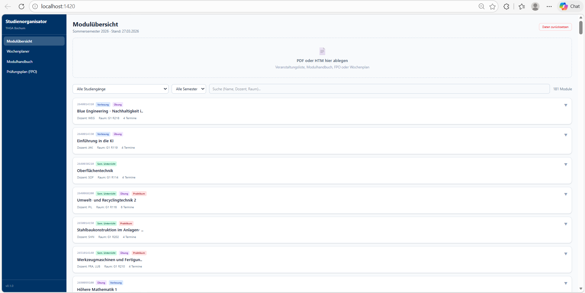
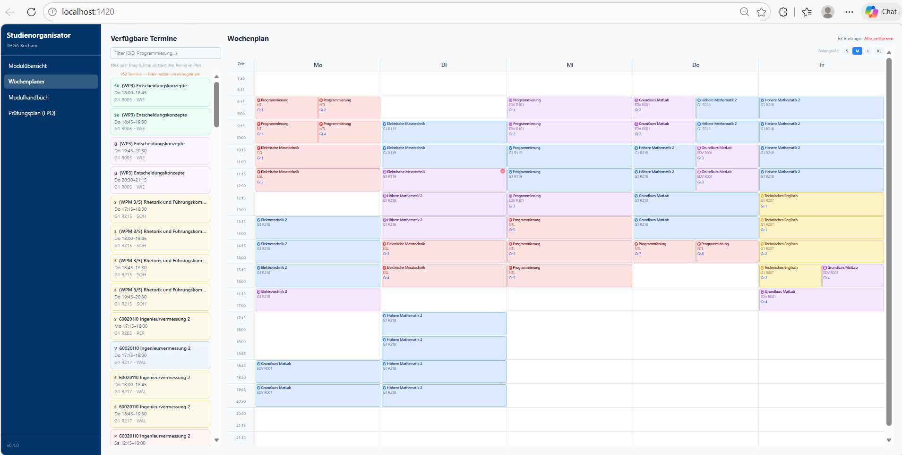
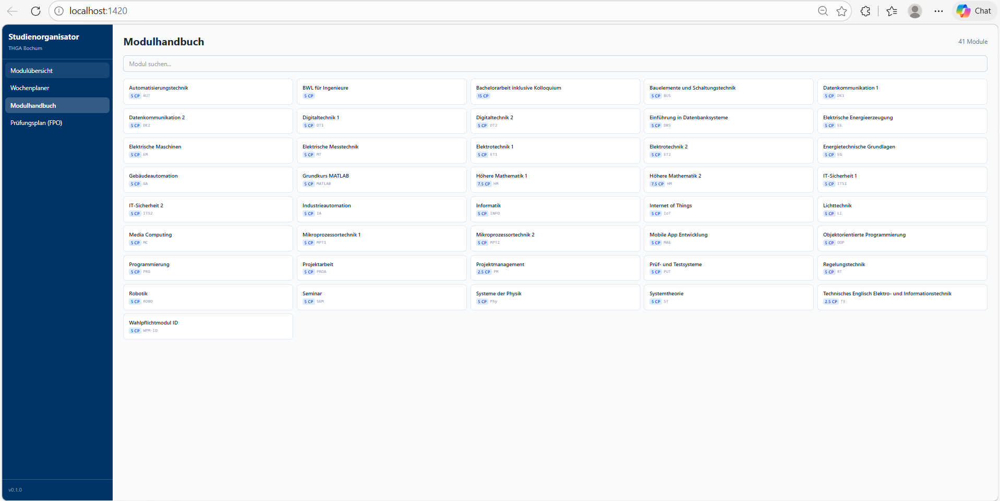
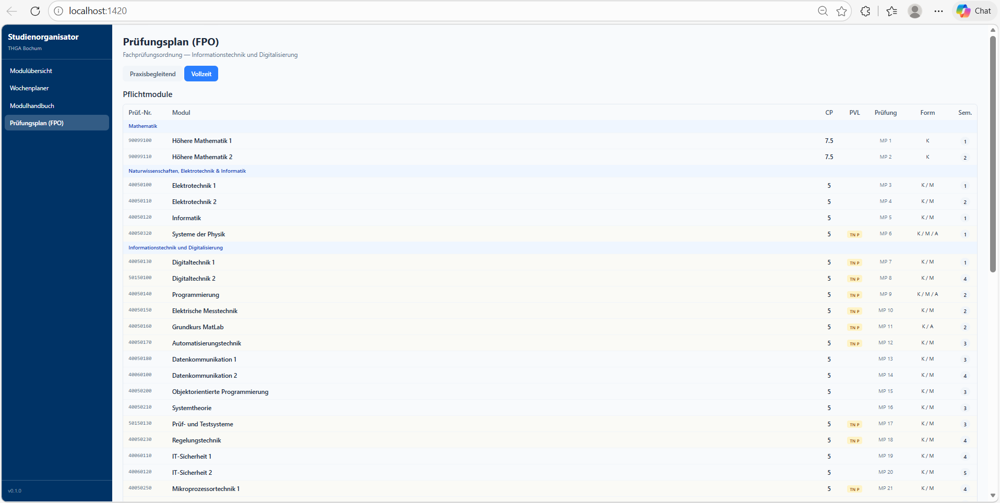
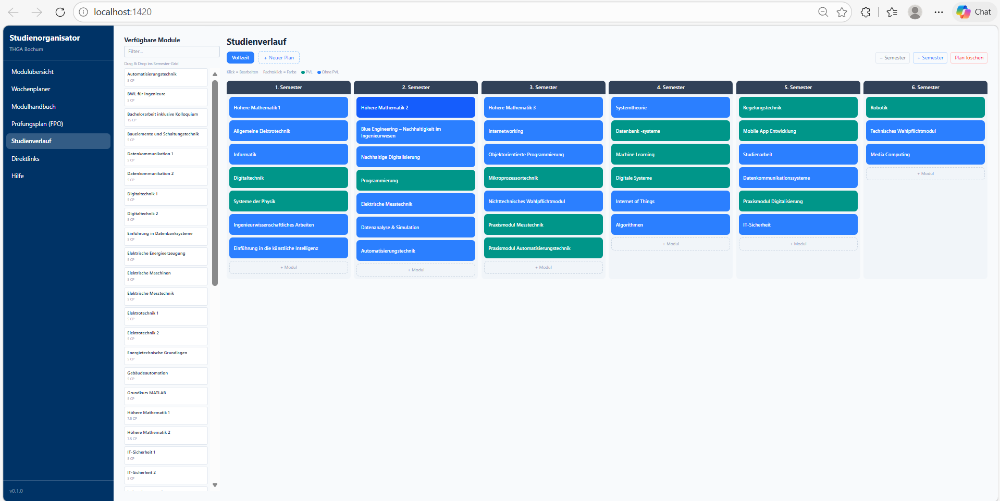
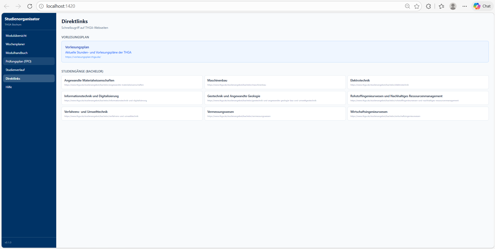
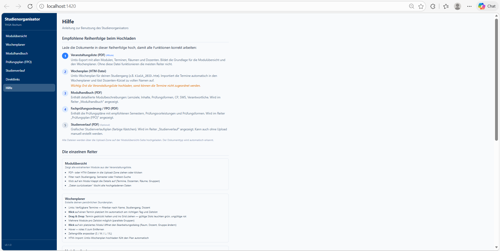

# Studienorganisator

Eine Desktop-Anwendung zur automatisierten Extraktion und Strukturierung von Studiendaten aus PDF-Dokumenten mit integriertem Wochenplaner.

Entwickelt für die Dokumente der **Technischen Hochschule Georg Agricola (THGA) Bochum** — erweiterbar für andere Hochschulen.


---

## Screenshots

| Modulübersicht | Wochenplaner |
|:-:|:-:|
|  |  |

| Modulhandbuch | Prüfungsplan (FPO) |
|:-:|:-:|
|  |  |

| Studienverlauf | Direktlinks | Hilfe |
|:-:|:-:|:-:|
|  |  |  |

---

## Motivation

Hochschulen verteilen studienrelevante Informationen über zahlreiche PDF-Dokumente:
Fachprüfungsordnungen, Modulhandbücher, Vorlesungsverzeichnisse. Diese Dokumente sind
oft komplex, uneinheitlich formatiert und schwer durchsuchbar.

Der **Studienorganisator** extrahiert automatisch strukturierte Daten aus diesen Dokumenten
und stellt sie in einem übersichtlichen Dashboard dar. Studierende können daraus ihren
individuellen Wochenplan zusammenstellen.

## Features

### Dokumenten-Extraktion
- **Veranstaltungsliste (PDF)**: Extrahiert Module, Termine, Räume, Dozenten, Studiengruppen aus Untis 2023 Exporten (getestet mit 136 Seiten, 421 Veranstaltungen, 2214 Termine)
- **Modulhandbuch (PDF)**: Extrahiert Module mit Kürzel, CP (inkl. 2.5/7.5), SWS, Modulverantwortlicher, Lernziele, Inhalte, Prüfungsformen, Voraussetzungen, PVL, WS/SS-Angebot
- **Fachprüfungsordnung (PDF)**: Extrahiert Prüfungspläne (Vollzeit + Praxisbegleitend) mit PVL, Prüfungsform, empfohlenem Semester, Wahlpflichtmodulen
- **Studienverlauf (PDF)**: Extrahiert Module aus grafischen Kästchen-Plänen per Curve-Erkennung mit PVL-Markierung
- **Wochenplan (HTM)**: Importiert Untis-Stundenpläne direkt in den Wochenplaner mit korrekter Tag+Zeit-Zuordnung via DB-Lookup
- **Automatische Dokumenterkennung**: Typ wird anhand von Dateiname und Seiteninhalt erkannt
- **Multi-Dokument-Support**: Mehrere Modulhandbücher und FPOs gleichzeitig laden — Daten werden nach Studiengang getrennt gespeichert und angezeigt

> **Hinweis:** Die PDF-Parser für Modulhandbuch und FPO sind aktuell auf die Studiengänge **Informationstechnik und Digitalisierung (BID)** und **Ingenieurinformatik (BII)** der THGA ausgelegt. Andere Studiengänge können abweichende PDF-Formate haben, die ggf. Parser-Anpassungen erfordern.

### Modulübersicht aktuell (Dashboard)
- PDF/HTM-Upload per Drag & Drop mit **Duplikat-Erkennung** (Bestätigungsdialog wenn Studiengang bereits vorhanden)
- Semester- und Studiengang-Filter
- Freitext-Suche über Modulname, Dozent, Raum
- Expandierbare Modulkarten mit farbkodierten Veranstaltungstypen (V/Ü/P/S/SU)
- Zusammengefasste Termine (gleiche Zeit + Raum = 1 Eintrag mit allen Klassen)
- Semester/Stand-Anzeige, **granularer Reset-Dialog** (pro Studiengang und Kategorie löschbar)

### Wochenplaner
- **Klick-to-Place**: Termin anklicken → automatisch am richtigen Tag+Zeitslot platziert
- **Drag & Drop**: Termine aus der Sidebar ins Grid ziehen — gültige Slots grün, ungültige rot
- **Mehrere Module pro Zeitslot** (parallele Gruppen nebeneinander)
- **Bearbeitbar**: Klick auf platziertes Modul öffnet Edit-Dialog (Raum, Dozent, Gruppe ändern)
- **Einstellbare Zellengröße** (S/M/L/XL)
- **Persistenz**: Wochenplan wird in der Datenbank gespeichert
- **HTM-Import**: Untis-Wochenplan hochladen → Plan wird automatisch befüllt
- THGA-Zeitraster (16 Slots, 7:30–22:00, inkl. Abend-Takt-Wechsel)

### Modulhandbücher
- **Studiengang-Switcher**: Bei mehreren Modulhandbüchern umschaltbar per Button-Gruppe
- Alle Module als klickbare Button-Kacheln mit CP und Kürzel
- Vollständige Detailansicht: Verantwortlicher, Studiensemester (WS/SS), Zuordnung, SWS, Arbeitsaufwand, Voraussetzungen, Lernziele, Inhalt, Prüfungsformen
- Suchfunktion

### Prüfungsplan (FPO)
- **Studiengang-Switcher** (oberste Ebene) + **Varianten-Switcher** (Vollzeit / Praxisbegleitend)
- Pflichtmodule-Tabelle gruppiert nach Fachbereich (Mathematik, Elektrotechnik, etc.)
- Separate Tabelle für empfohlene Wahlpflichtmodule
- PVL-Markierung, Prüfungsform, Semester-Empfehlung pro Modul

### Studienverlauf
- Visuelles Semester-Grid mit farbigen Kästchen (wie im Original-PDF)
- Module per **Drag & Drop** aus der Modulhandbuch-Sidebar ins Grid ziehen
- **Sidebar zeigt Module aus allen Modulhandbüchern** — alphabetisch sortiert, farbkodiert nach Studiengang, mit Checkbox-Filter
- Module **rausziehen** (außerhalb der Semester) zum Löschen
- Klick zum Bearbeiten, Rechtsklick für Farbwähler (7 Farben)
- Semester hinzufügen/entfernen
- Mehrere Pläne gleichzeitig (Vollzeit + Praxisbegleitend + eigene)
- Auch ohne Upload nutzbar (leeres Grid zum Selbstausfüllen)
- PDF-Import: Curve-basierter Parser erkennt Kästchen-Grenzen exakt

### Direktlinks
- Schnellzugriff auf die THGA-Studiengangsseite (Informationstechnik und Digitalisierung)
- Link zum Vorlesungsplan (vorlesungsplan.thga.de)

### Hilfe
- Empfohlene Upload-Reihenfolge (1. Veranstaltungsliste → 2. HTM → 3. Modulhandbuch → 4. FPO → 5. Studienverlauf)
- Bedienungsanleitung pro Reiter
- Tipps (lokale Datenverarbeitung, Auto-Shutdown, Troubleshooting)

### Sonstiges
- **Desktop-Verknüpfung**: Doppelklick startet Backend + Frontend + öffnet Browser
- **Auto-Shutdown**: Backend + Vite beenden sich automatisch wenn der Browser-Tab geschlossen wird
- **Offline-fähig**: Läuft vollständig lokal — keine Cloud, keine externen APIs
- **Schema-Auto-Migration**: DB passt sich automatisch an Schema-Änderungen an

## Tech-Stack

| Schicht | Technologie | Warum |
|---------|------------|-------|
| Desktop-Shell | Tauri 2.x | Leichtgewichtig, nativ, sicher |
| Frontend | React 19 + TypeScript + Vite | Typsicherheit, schnelle Entwicklung |
| Styling | Tailwind CSS 4 | Utility-First, kein CSS-Overhead |
| Drag & Drop | @dnd-kit | Aktiv gepflegt, barrierefrei |
| Backend | Python FastAPI | Async, automatische OpenAPI-Doku |
| Datenbank | SQLite (SQLAlchemy ORM) | Kein Server nötig, migrierbar |
| PDF-Extraktion | pdfplumber + PyMuPDF | Tabellen-, Text- und Curve-Erkennung |
| HTML-Parsing | BeautifulSoup + lxml | Untis HTM-Wochenpläne |

## Projektstruktur

```
studienorganisator/
├── src/                        # React-Frontend
│   ├── components/
│   │   ├── dashboard/          # Modulübersicht, Upload, Filter
│   │   ├── scheduler/          # Wochenplaner (Grid, Sidebar, DnD)
│   │   ├── modulhandbuch/      # Modulhandbuch-Viewer
│   │   ├── fpo/                # Prüfungsplan-Ansicht
│   │   ├── studienverlauf/     # Visueller Semester-Plan
│   │   ├── direktlinks/        # THGA-Schnellzugriff
│   │   └── hilfe/              # Bedienungsanleitung
│   ├── hooks/                  # use_modules (API-Anbindung)
│   ├── lib/                    # Typisierter API-Client
│   └── types/                  # Shared TypeScript-Interfaces
├── backend/                    # Python FastAPI
│   ├── app/
│   │   ├── core/               # Konfiguration (aus .env)
│   │   ├── models/             # SQLAlchemy Models (DB, FPO, Modulhandbuch, Studienverlauf)
│   │   ├── routers/            # API-Endpunkte
│   │   │   ├── pdf_router.py   # Upload + Auto-Erkennung (5 Dokumenttypen)
│   │   │   ├── module_router.py
│   │   │   ├── schedule_router.py
│   │   │   ├── modulhandbuch_router.py
│   │   │   ├── fpo_router.py
│   │   │   └── studienverlauf_router.py
│   │   └── services/           # Parser
│   │       ├── veranstaltungsliste_parser.py
│   │       ├── htm_parser.py
│   │       ├── modulhandbuch_parser.py
│   │       ├── fpo_parser.py
│   │       └── studienverlauf_parser.py
│   ├── parser_profiles/        # Hochschulspezifische Extraktionsregeln
│   └── data/                   # SQLite DB (gitignored)
├── scripts/
│   └── start.bat               # Windows-Startskript (Auto-Shutdown)
├── src-tauri/                  # Tauri Desktop-Shell (Rust)
├── docs/                       # Architektur, ADRs, Datenquellen-Analyse, Screenshots
├── SECURITY.md
└── LICENSE
```

## Schnellstart

### Voraussetzungen

- **Node.js** >= 18
- **Python** >= 3.11
- **Git**

### Installation

```bash
# Repository klonen
git clone https://github.com/p-keminer/studienorganisator-thga-bochum.git
cd studienorganisator-thga-bochum

# Frontend-Abhängigkeiten
npm install

# Python-Backend
cd backend
python -m venv .venv
# Windows:
.venv\Scripts\activate
# Linux/Mac:
# source .venv/bin/activate
pip install -r requirements.txt
cd ..

# Umgebungsvariablen
cp .env.example backend/.env
```

### Starten

**Option 1: Desktop-Verknüpfung (Windows)**
```
Doppelklick auf "Studienorganisator" auf dem Desktop
```

**Option 2: Manuell**
```bash
# Terminal 1: Backend
cd backend
.venv\Scripts\activate
python -m uvicorn app.main:app --host 127.0.0.1 --port 8321

# Terminal 2: Frontend
npm run dev
```

Dann im Browser: **http://localhost:1420**

### Benutzung

1. **Veranstaltungsliste** (PDF) hochladen → Module erscheinen im Dashboard
2. **Wochenplan** (HTM) hochladen → Stundenplan wird im Wochenplaner befüllt
3. **Modulhandbuch** (PDF) hochladen → Moduldetails im Modulhandbuch-Tab
4. **FPO** (PDF) hochladen → Prüfungsplan im FPO-Tab
5. **Studienverlauf** (PDF) hochladen → Visueller Semesterplan
6. Im **Wochenplaner** Termine per Klick oder Drag & Drop platzieren
7. Im **Studienverlauf** eigenen Plan zusammenstellen

## API-Dokumentation

Im Entwicklungsmodus (`DEBUG_MODE=true` in `.env`):
- Swagger UI: http://localhost:8321/docs
- ReDoc: http://localhost:8321/redoc

### Endpunkte

| Methode | Pfad | Beschreibung |
|---------|------|-------------|
| `POST` | `/api/pdf/detect` | Dokument analysieren (Typ + Studiengang, ohne DB-Write) |
| `POST` | `/api/pdf/upload` | Dokument hochladen (Auto-Erkennung: 5 Typen) |
| `GET` | `/api/modules/` | Module mit Filtern |
| `GET` | `/api/modules/info` | Semester/Stand-Info |
| `GET` | `/api/modules/reset-info` | Übersicht vorhandener Daten (für Reset-Dialog) |
| `POST` | `/api/modules/reset-selective` | Gezielt Datenkategorien löschen |
| `DELETE` | `/api/modules/reset` | Datenbank komplett leeren |
| `GET` | `/api/schedule/` | Wochenplan laden |
| `POST` | `/api/schedule/` | Wochenplan-Eintrag erstellen |
| `DELETE` | `/api/schedule/{id}` | Eintrag löschen |
| `GET` | `/api/modulhandbuch/` | Modulhandbuch-Daten (optional `?studiengang=X`) |
| `GET` | `/api/modulhandbuch/studiengaenge` | Liste vorhandener Studiengänge (Modulhandbuch) |
| `GET` | `/api/fpo/` | Prüfungspläne (optional `?studiengang=X`) |
| `GET` | `/api/fpo/studiengaenge` | Liste vorhandener Studiengänge (FPO) |
| `GET` | `/api/studienverlauf/` | Studienverlaufspläne |
| `POST` | `/api/studienverlauf/modul` | Modul zum Plan hinzufügen |
| `PUT` | `/api/studienverlauf/modul/{id}` | Modul bearbeiten/verschieben |
| `DELETE` | `/api/studienverlauf/modul/{id}` | Modul entfernen |
| `POST` | `/api/heartbeat` | Frontend-Heartbeat (Auto-Shutdown) |

## Parser-Robustheit

Alle Parser arbeiten **inhaltsbasiert**, nicht seitenbasiert:

| Parser | Erkennungsmethode |
|--------|------------------|
| Veranstaltungsliste | Zwei-Zeilen-Header-Pattern (Modulnummer + Name) auf jeder Seite |
| Modulhandbuch | Split an "Modulbeschreibung"-Markern, Regex-Extraktion aller Felder, Multi-Page-Merging (BII), Kürzel-Fallback aus Inhaltsverzeichnis |
| FPO | Sucht "Prüfungsplan"/"Studienverlaufsplan" im Seitentext + pdfplumber Tabellenerkennung, Auto-Erkennung BID-Format (7 Spalten) vs. BII-Format (15-23 Spalten) |
| Studienverlauf | Curve-Erkennung (gefüllte Pfade = farbige Kästchen) + Text innerhalb der Bounding Box |
| HTM-Wochenplan | BeautifulSoup-Parsing + DB-Lookup für Tag/Zeit-Zuordnung |

Die Parser funktionieren auch wenn sich Seitenzahlen ändern, Module hinzukommen oder das Layout leicht variiert.

## Erweiterbarkeit

### Andere Hochschulen

Parser-Profile unter `backend/parser_profiles/` definieren hochschulspezifische Regex-Muster.
Siehe `backend/parser_profiles/README.md` für das Schema.

### Geplante Features

- [ ] Parser-Erweiterung für weitere THGA-Studiengänge

## Sicherheit

- Bindet nur an `127.0.0.1` (nicht erreichbar von außen)
- PDF-Upload mit Magic-Byte-Validierung
- Parametrisierte SQL-Queries (SQLAlchemy ORM)
- Keine hartcodierten Geheimnisse
- Auto-Shutdown nach 45 Sekunden ohne Frontend-Heartbeat
- Siehe [SECURITY.md](./SECURITY.md)

## Hinweise

- **Keine Gewähr:** Die extrahierten Daten dienen zur Orientierung. Verbindlich sind ausschließlich die offiziellen Dokumente der Hochschule. Prüfe insbesondere Prüfungsanmeldungen und Fristen immer anhand der originalen FPO.
- **Keine Hochschul-Dokumente im Repo:** Veranstaltungslisten, Modulhandbücher, FPOs und Wochenpläne sind Eigentum der jeweiligen Hochschule und dürfen nicht in dieses Repository hochgeladen werden.
- **Datenschutz:** Die App verarbeitet alle Daten ausschließlich lokal. Es werden keine Daten an externe Server übertragen.

## Lizenz

MIT — siehe [LICENSE](./LICENSE)
