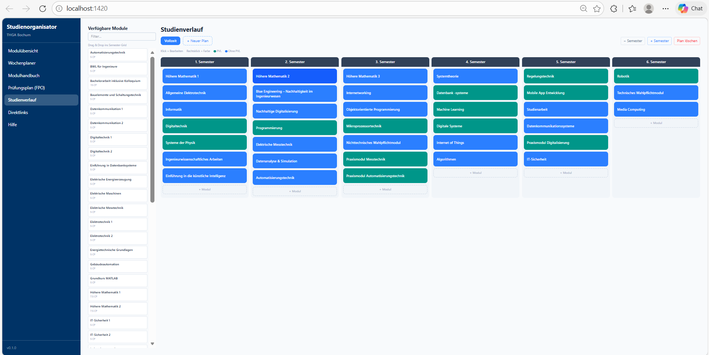

<a id="top"></a>

<div align="center">

[](#deutsch)
[](#english)

</div>

---

<a id="deutsch"></a>

<a id="studienorganisator"></a>

# Studienorganisator

Lokale Webanwendung zum Strukturieren ausgewählter THGA-Unterlagen, zum Durchsuchen von
Modul- und Prüfungsdaten sowie zum Erstellen persönlicher Wochen- und Studienverlaufspläne.

`STUDIENORGANISATION` · `LOKALE DATEN` · `THGA BID / BII`

`React 19` · `TypeScript` · `FastAPI` · `SQLite` · `pdfplumber`

<div align="center">

[](#überblick)
[](#funktionen)
[](#unterstützte-eingaben)
[](#schnellstart)
[](#dokumentation)
[](#projektstatus)

</div>

## Überblick

Der Studienorganisator liest lokal bereitgestellte PDF- und HTM-Dateien ein und legt die
extrahierten Daten in einer lokalen SQLite-Datenbank ab. Die Parser orientieren sich an den
derzeit unterstützten THGA-Formaten; Modulhandbuch und FPO sind insbesondere auf
**Informationstechnik und Digitalisierung (BID)** sowie **Ingenieurinformatik (BII)**
zugeschnitten.

Die Anwendung ruft keine Hochschuldokumente selbstständig ab und verwendet für die
Verarbeitung keine Cloud-Dienste.

## Funktionen

| Bereich | Aktueller Funktionsumfang |
|---|---|
| Modulübersicht | Suche nach Modulname, Lehrendenkürzel und Raum, Studiengangs-/Semesterfilter sowie Termin- und Gruppendetails |
| Wochenplaner | Montag bis Freitag, 16 Zeitslots, parallele Einträge, Bearbeitung und lokale Persistenz |
| Modulhandbücher | Studiengangsauswahl, Suche und Detailansicht der extrahierten Moduldaten |
| Prüfungsplan / FPO | Pflicht- und Wahlpflichtmodule für erkannte Studiengänge und Studienvarianten |
| Studienverlauf | Mehrere Pläne, Semester und manuelle Module mit Drag-and-drop und lokalen Farben |
| Direktlinks | Verweise auf die BID-Seite der THGA und den THGA-Vorlesungsplan |

| Studienverlauf |
|:-:|
|  |

## Unterstützte Eingaben

| Eingabe | Format | Verwendung |
|---|---|---|
| Veranstaltungsliste | PDF aus Untis 2023 | Module, Termine, Räume, Lehrende, Gruppen und Semesterstand |
| Wochenplan | HTM / HTML aus Untis | Einträge für den Wochenplaner; Tag und Zeit werden über zuvor importierte Veranstaltungen zugeordnet |
| Modulhandbuch | PDF | CP, SWS, Verantwortliche, Voraussetzungen, Lernziele, Inhalte und Prüfungsformen |
| Fachprüfungsordnung | PDF | Pflicht-/Wahlpflichtmodule, Semesterempfehlungen, PVL und Prüfungsformen |
| Studienverlauf | PDF | Module und Semester aus dem grafischen Plan der ersten Seite |

Die Parser sind format- und layoutgebunden. Details zur empfohlenen Importreihenfolge,
zum Ersetzungsverhalten und zu bekannten Grenzen stehen in den
[`Datenquellen`](docs/DATENQUELLEN.md#deutsch).

## Schnellstart

### Voraussetzungen

- Windows für `start.bat`; PowerShell für die folgenden Einrichtungsbefehle
- Node.js `20.19.x` oder `>=22.12.0`
- Python `3.11+` mit Windows-Python-Launcher (`py`)
- Git

### Einmalige Einrichtung

```powershell
git clone https://github.com/p-keminer/studienorganisator-thga-bochum-bid-bii.git
cd studienorganisator-thga-bochum-bid-bii

npm install --package-lock=false
py -m venv backend\.venv
backend\.venv\Scripts\python.exe -m pip install -r backend\requirements.txt
New-Item -ItemType Directory -Force backend\data | Out-Null
```

### Start

```powershell
.\scripts\start.bat
```

Das Skript startet Vite, öffnet `http://localhost:1420` und führt FastAPI lokal auf
`127.0.0.1:8321` aus. Alternativ können Frontend und Backend getrennt gestartet werden:

```powershell
# Terminal 1 — Repository-Wurzel
npm run dev -- --host 127.0.0.1 --port 1420

# Terminal 2 — Repository-Wurzel
cd backend
.\.venv\Scripts\python.exe -m uvicorn app.main:app --host 127.0.0.1 --port 8321
```

Die Standardwerte funktionieren ohne `.env`. Für lokale Abweichungen kann
`.env.example` nach `backend\.env` kopiert werden.

## Dokumentation

- [Architektur und Laufzeit](docs/ARCHITECTURE.md#deutsch)
- [Datenquellen und Parsergrenzen](docs/DATENQUELLEN.md#deutsch)
- [Lokaler Betrieb und Datenablage](SECURITY.md#deutsch)
- [MIT-Lizenz](LICENSE)

## Projektstatus

Der vollständig verbundene Laufzeitpfad ist derzeit **Vite → FastAPI → SQLite**. Das
Verzeichnis `src-tauri/` enthält ein Tauri-Gerüst, startet aber noch kein Python-Backend
und stellt in einem Produktionsbuild keinen API-Proxy bereit. `npm run build` erzeugt
daher den Frontend-Build, keine eigenständig funktionsfähige Desktop-Anwendung.

Der vorhandene `package-lock.json` ist bei optionalen transitiven Abhängigkeiten nicht
mehr vollständig mit `package.json` synchron. Deshalb verwendet der Schnellstart derzeit
`npm install --package-lock=false`; `npm ci` benötigt zunächst einen separat geprüften
Lockfile-Abgleich.

Reguläre Uploads bleiben lokal unter `backend/uploads/`; die Datenbank liegt standardmäßig
unter `backend/data/`. Ein Datenbank-Reset entfernt die hochgeladenen Quelldateien nicht.
Für verbindliche Angaben gelten weiterhin die offiziellen Dokumente der THGA.

<div align="center">

[](#top)

</div>

---

<a id="english"></a>

<a id="study-organiser"></a>

# Study Organiser

Local web application for structuring selected THGA documents, searching module and exam
data, and creating personal weekly schedules and study plans.

`STUDY ORGANISATION` · `LOCAL DATA` · `THGA BID / BII`

`React 19` · `TypeScript` · `FastAPI` · `SQLite` · `pdfplumber`

<div align="center">

[](#overview)
[](#features)
[](#supported-inputs)
[](#quick-start)
[](#documentation)
[](#project-status)

</div>

## Overview

The Study Organiser imports locally supplied PDF and HTM files and stores the extracted
data in a local SQLite database. Its parsers target the currently supported THGA formats;
the module-handbook and FPO parsers are tailored particularly to **Informationstechnik und
Digitalisierung (BID)** and **Ingenieurinformatik (BII)**.

The application does not retrieve university documents automatically and does not use
cloud services for processing.

## Features

| Area | Current functionality |
|---|---|
| Module overview | Search by module name, lecturer code and room, programme/semester filters, plus date and group details |
| Weekly planner | Monday to Friday, 16 time slots, parallel entries, editing and local persistence |
| Module handbooks | Programme selection, search and detailed extracted module data |
| Examination plan / FPO | Mandatory and elective modules for recognised programmes and variants |
| Study progression | Multiple plans, semesters and manual modules with drag-and-drop and local colours |
| Direct links | Links to the THGA BID page and the THGA timetable |

| Study progression |
|:-:|
|  |

## Supported inputs

| Input | Format | Use |
|---|---|---|
| Class list | Untis 2023 PDF | Modules, dates, rooms, lecturers, groups and semester status |
| Weekly timetable | Untis HTM / HTML | Planner entries; day and time are resolved through previously imported classes |
| Module handbook | PDF | CP, SWS, coordinators, prerequisites, learning goals, content and examination forms |
| Examination regulations | PDF | Mandatory/elective modules, recommended semesters, PVL and examination forms |
| Study progression | PDF | Modules and semesters from the graphical plan on the first page |

The parsers depend on specific document formats and layouts. The recommended import order,
replacement behaviour and known limits are documented under
[`Data sources`](docs/DATENQUELLEN.md#english).

## Quick start

### Requirements

- Windows for `start.bat`; PowerShell for the setup commands below
- Node.js `20.19.x` or `>=22.12.0`
- Python `3.11+` with the Windows Python Launcher (`py`)
- Git

### One-time setup

```powershell
git clone https://github.com/p-keminer/studienorganisator-thga-bochum-bid-bii.git
cd studienorganisator-thga-bochum-bid-bii

npm install --package-lock=false
py -m venv backend\.venv
backend\.venv\Scripts\python.exe -m pip install -r backend\requirements.txt
New-Item -ItemType Directory -Force backend\data | Out-Null
```

### Start

```powershell
.\scripts\start.bat
```

The script starts Vite, opens `http://localhost:1420`, and runs FastAPI locally on
`127.0.0.1:8321`. Frontend and backend can also be started separately:

```powershell
# Terminal 1 — repository root
npm run dev -- --host 127.0.0.1 --port 1420

# Terminal 2 — repository root
cd backend
.\.venv\Scripts\python.exe -m uvicorn app.main:app --host 127.0.0.1 --port 8321
```

The defaults work without an `.env` file. For local overrides, copy `.env.example` to
`backend\.env`.

## Documentation

- [Architecture and runtime](docs/ARCHITECTURE.md#english)
- [Data sources and parser limits](docs/DATENQUELLEN.md#english)
- [Local operation and data storage](SECURITY.md#english)
- [MIT licence](LICENSE)

## Project status

The fully connected runtime path is currently **Vite → FastAPI → SQLite**. The
`src-tauri/` directory contains a Tauri scaffold, but it does not yet launch the Python
backend and does not provide an API proxy in production builds. Consequently,
`npm run build` creates the frontend build rather than a self-contained desktop
application.

The existing `package-lock.json` is no longer fully aligned with `package.json` for
optional transitive dependencies. The quick start therefore currently uses
`npm install --package-lock=false`; `npm ci` first requires a separately reviewed lockfile
refresh.

Regular uploads remain locally under `backend/uploads/`; by default, the database is
stored under `backend/data/`. A database reset does not delete uploaded source files.
Official THGA documents remain authoritative.

<div align="center">

[](#top)

</div>
